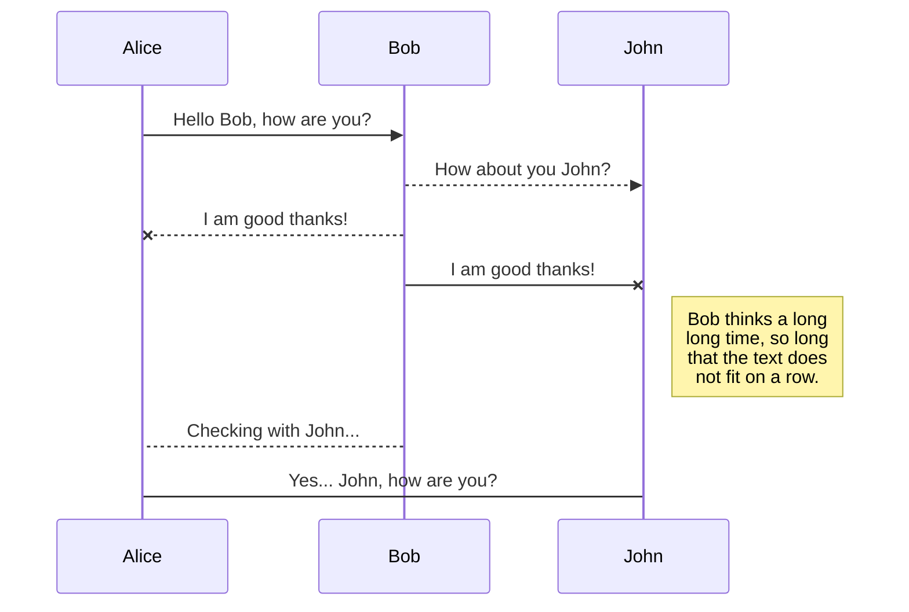
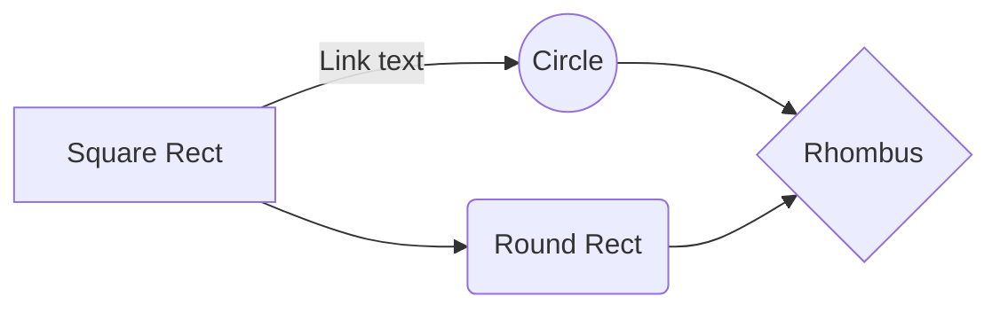

# React Data Dashboard

**React Data Dashboard** is a client/server based application written in Node, Javascript and React. This application is extremely portable and can be used for a wide variety of applications.

# Pre-Installation Notes

The following dependencies are required to run **React Data Dashboard** on your local machine.

## Global Dependencies

The following dependencies are required to be installed before attempting to install **React Data Dashboard** locally. Please install them using **npm install -g package-name**

|Package |Version  |Installation     |
|--------|---------|--------|
|Node    |`^6.10`  |Link    |
|NPM     |`^3.10`  |Link    |
|git     |`^2.10`  |Link    |
|MongoDB |`^3.6.3` |Link    |
|Yarn    |`^1.5`   |Link    |
|Nodemon |`^1.17`  |npm i -g nodemon |

## Server Dependencies

All of these packages will be installed during installation, there is no need to install them globally before trying to install **React Data Dashboard**.

|Package      |Version    |
|-------------|-----------|
|body-parser  |`^1.18.2`  |
|concurrently |`^3.5.1`   |
|cors         |`^2.8.4`   |
|express      |`^4.16.2`  |
|mongodb      |`^3.0.4`   |

## Client Dependencies

All of these packages will be installed during installation, there is no need to install them globally before trying to install **React Data Dashboard**.

|Package          |Version    |
|-----------------|-----------|
|css-loader       |`^0.28.10` |
|react            |`15.5.3`   |
|react-dom        |`15.5.3`   |
|react-router-dom |`4.1.1`    |
|react-scripts    |`1.0.0`    |

# Installation

To install **React Data Dashboard**, two seperate Node apps need to be installed, the server and the client. After installing the required global dependencies, run the following command in a new terminal window to install both apps at the same time.
**npm install && cd client && npm install && cd ..**
This will install both the client and server application, which can now be initilized by entering the following command in the terminal window:
**npm start**
Note that if MongoDB is not setup to run in the background **npm start** will fail. If this happens, open a new terminal window and type **mongod** to start the MongoDB server. Once this is running, return to the main terminal window and run **npm start** again.

# Client

# Server

# Future Updates

## UML diagrams

You can render UML diagrams using [Mermaid](https://mermaidjs.github.io/). For example, this will produce a sequence diagram:

And this will produce a flow chart:

